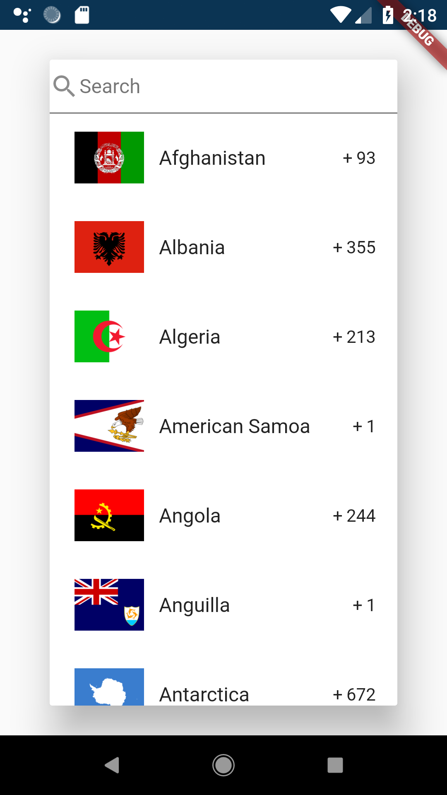
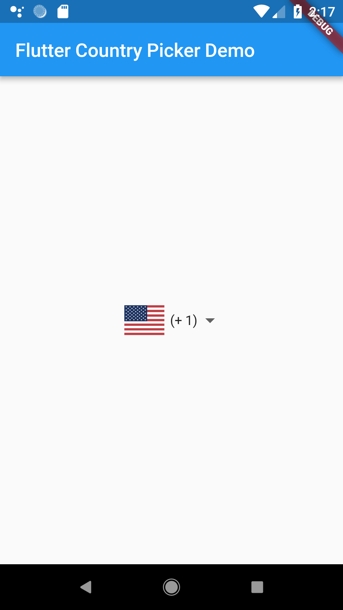

[](https://pub.dartlang.org/packages/flutter_country_picker)

# flutter_country_picker
A Flutter Country Picker Widget with support to country dialing codes

  


## Usage

Add the CountryPicker widget in your layout and use the `onChanged` callback.  
[Full example](https://github.com/biessek/flutter_country_picker/tree/master/example)

 ```dart

  @override
  Widget build(BuildContext context) {
    return new Scaffold(
      appBar: new AppBar(
        title: Text('Flutter Country Picker Demo'),
      ),
      body: new Center(
        child: CountryPicker(
          onChanged: (Country country) {
            setState(() {
              _selected = country;
            });
          },
          selectedCountry: _selected,
        ),
      ),
    );
  }

 ```